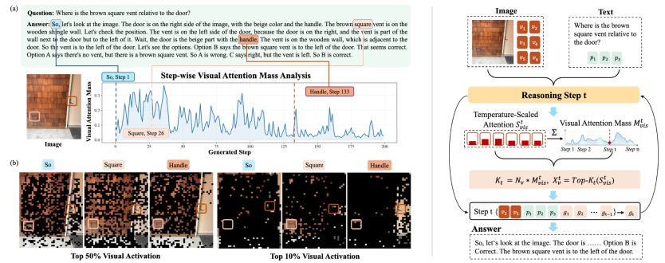
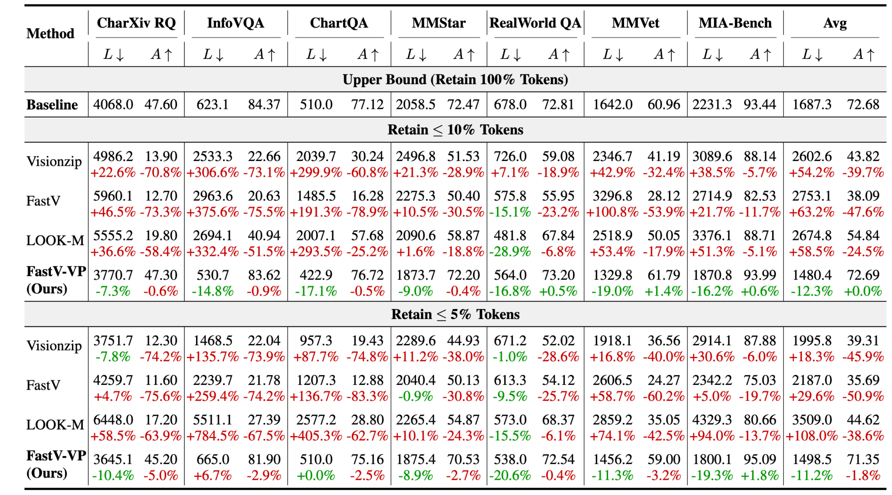
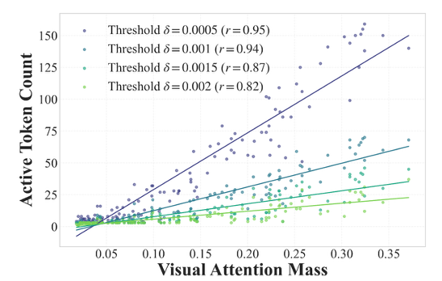
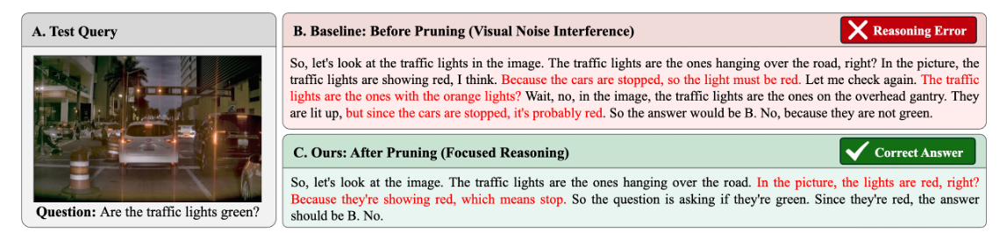
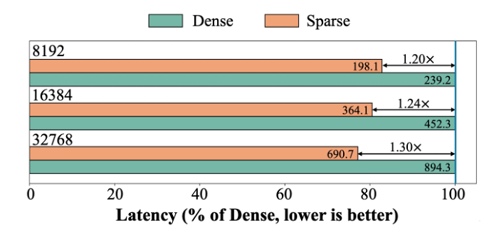

<h1 align="center"> VisionPulse: Dynamic Visual Sparsity for Efficient Multimodal Reasoning</h1>

<p align="center">
  <a href="https://arxiv.org/abs/2605.31457"></a>
  
  <a href="LICENSE"></a>
</p>

**VisionPulse** is a dynamic visual sparse attention framework in Multimodal Reasoning Models. Guided by step-dependent visual evidence, it uses visual attention mass to estimate step-wise retention budgets and select critical visual tokens. Across seven benchmarks, VisionPulse achieves **no accuracy loss** while retaining **≤10% of visual tokens per step**. Even under more aggressive compression with **≤5% retention**, it preserves **98.2% of full-token performance** and shortens reasoning traces by **11.2%**.

## 🔍 Overview



Dynamic visual activations during reasoning and the VisionPulse framework.

- **Visual evidence is strongly step-dependent:** the critical visual token set
evolves across decoding steps, while existing methods typically fix a single
visual subset at prefill.
- **VisionPulse performs step-wise token selection during reasoning**, retaining
critical visual tokens as the reasoning state evolves and filtering redundant
visual context.
- **Visual attention mass guides the step-wise retention budget**, exploiting its
strong positive correlation with LMMs' effective visual token usage.


## 📊 Main Results

Across seven benchmarks, VisionPulse achieves **no loss in average accuracy**
with **≤10% of visual tokens per step**, while shortening reasoning traces by
**12.3%**. Even with **≤5% retention**, it preserves **98.2% of full-token
performance** and shortens reasoning traces by **11.2%**.



<details>
<summary><strong>More analysis and efficiency results</strong></summary>

**Visual attention mass predicts the number of activated visual tokens.** The
trend remains consistent across a range of thresholds (Pearson $r$ ranges from
0.82 to 0.95).



**Coupled bottleneck in multimodal reasoning.** Redundant visual tokens can draw
attention to query-irrelevant cues, leading to unnecessary descriptions and even
erroneous reasoning.



**Latency comparison.** The paper reports
**1.20×–1.30×** speedups. See the [efficiency analysis guide](analysis/efficiency/README.md)
for the Triton implementation and speed benchmark.



</details>

## 🚀 Quick Start

VisionPulse is a plug-and-play framework with implementations for the **Qwen3-VL series**.
The core algorithm can be found [here](visionpulse/modeling_qwen3_vl.py).

### 1. Installation

```bash
git clone https://github.com/xxhhbbbb/VisionPulse.git
cd VisionPulse
conda create -n visionpulse python=3.12 -y
conda activate visionpulse
python -m pip install torch==2.4.0 torchvision==0.19.0 --index-url https://download.pytorch.org/whl/cu121
python -m pip install -e .
```

### 2. Evaluation

We use the original **Qwen3-VL-Thinking** model weights, which are downloaded automatically from Hugging Face.
To use local weights, update `model_path` in [config.py](vlmeval/config.py).
Prepare the datasets and judge API following the
[evaluation guide](docs/evaluation/README.md#datasets-and-scoring), then run both
VisionPulse settings on the seven main-table benchmarks:

```bash
# Retain ≤10% of visual tokens per step.
python run.py --model Qwen3-VL-4B-Thinking-VisionPulse-10pct \
  --data CharXiv_reasoning_val InfoVQA_VAL ChartQA_TEST MMStar RealWorldQA MMVet MIA-Bench \
  --work-dir outputs/main_table/10pct

# Retain ≤5% of visual tokens per step.
python run.py --model Qwen3-VL-4B-Thinking-VisionPulse-5pct \
  --data CharXiv_reasoning_val InfoVQA_VAL ChartQA_TEST MMStar RealWorldQA MMVet MIA-Bench \
  --work-dir outputs/main_table/5pct
```

Predictions and benchmark scores are saved under
`outputs/main_table/`. See the [evaluation guide](docs/evaluation/README.md) for
details and the [model guide](docs/models/README.md) for other supported models.

For single-example inference, load Qwen3-VL with VisionPulse and provide an image and a question:

```python
from vlmeval.config import supported_VLM

# Load the original model and enable VisionPulse.
model = supported_VLM["Qwen3-VL-4B-Thinking-VisionPulse-10pct"]()

response = model.generate([
    {"type": "image", "value": "assets/vent_example.png"},
    {"type": "text", "value": "Where is the brown square vent relative to the door?"},
])
print(response)
```


## 🔬 Analysis Tools

We provide the following tools for visual attention and efficiency analysis.
See the [analysis guide](analysis/README.md) for setup and usage.

| Analysis | Purpose | Code and usage |
|---|---|---|
| Visual activation visualization | Visualize how critical visual tokens change across reasoning steps. | [Activation](analysis/activation/README.md) |
| Attention mass correlation | Analyze the relationship between visual attention mass and active visual token count. | [Attention mass](analysis/attention_mass/README.md) |
| Layer-wise attention similarity | Measure cosine similarity between visual attention distributions across layers. | [Layer similarity](analysis/layer_similarity/README.md) |
| Efficiency analysis | Compare dense and sparse latency across context lengths. | [Efficiency](analysis/efficiency/README.md) |

## 🔗 Citation

If you find VisionPulse useful in your research, please consider giving us a star ⭐
and citing our work:

```bibtex
@article{xu2026visionpulse,
  title={VisionPulse: Dynamic Visual Sparsity for Efficient Multimodal Reasoning},
  author={Hengbo Xu and Shengjie Jin and Yanbiao Ma and Zhiwu Lu},
  journal={arXiv preprint arXiv:2605.31457},
  year={2026},
  url={https://arxiv.org/abs/2605.31457}
}
```


## 🤝 Acknowledgements

Our codebase is built upon [VLMEvalKit](https://github.com/open-compass/VLMEvalKit).
Our work also draws inspiration from [FastV](https://arxiv.org/abs/2403.06764),
[VisionZip](https://arxiv.org/abs/2412.04467), [LOOK-M](https://arxiv.org/abs/2406.18139),
[SparseVLM](https://arxiv.org/abs/2410.04417), and related research.
We thank the authors and contributors of these projects for their valuable insights and open-source contributions.

## 📄 License

VisionPulse is licensed under the [Apache License 2.0](LICENSE).
