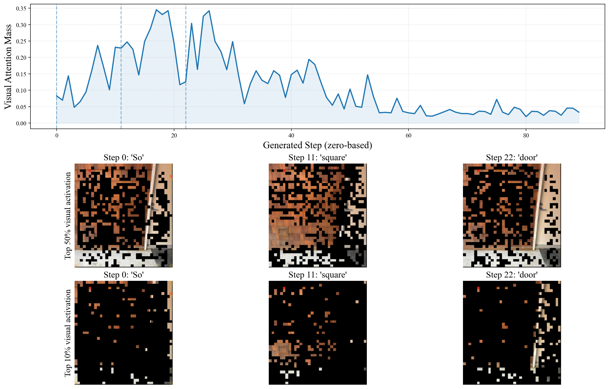

# Visual activation

Visualize how attention to image regions changes as the model reasons.

## Run

Follow the [analysis setup](../README.md#get-started), then run:

```bash
python -m analysis.run activation \
  --model Qwen/Qwen3-VL-4B-Thinking \
  --image assets/vent_example.png \
  --steps 0 11 22 \
  --output-dir outputs/analysis/activation
```

Output: **`outputs/analysis/activation/visual_activation.png`**.
Use `--image` and `--question` for your own input, and `--model /path/to/model`
for local weights. `--steps` selects generated token positions, starting from 0;
omit it to select three evenly spaced steps automatically.

## Example



The blue curve shows visual attention mass across decoding steps. The image
panels highlight the top 50% and 10% of visual activations at the selected steps.
This example uses Qwen3-VL-4B-Thinking, layer 17, and the vent-position question;
the selected tokens are **“So”, “square”, and “door”**.

## Plot saved attention

For [collected traces](../README.md#analyze-multiple-samples), select steps and
masking percentiles without running the model again:

```bash
python -m analysis.activation.visualize \
  --data outputs/analysis/traces/sample_0000/trace.npz \
  --steps 0 11 22 --prune-levels 50 90
```

`--prune-levels 50 90` masks the bottom 50% and 90% of scores, respectively.
