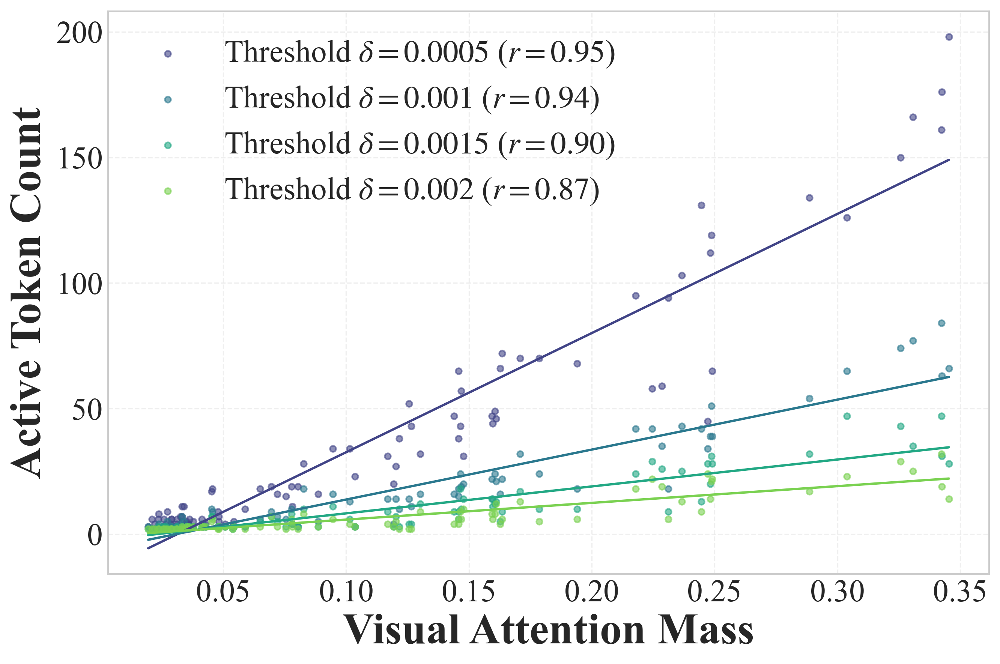

# Attention mass correlation

Examine whether greater visual attention mass corresponds to more active visual
tokens during reasoning.

## Run

Follow the [analysis setup](../README.md#get-started), then run:

```bash
python -m analysis.run attention_mass \
  --model Qwen/Qwen3-VL-4B-Thinking \
  --image assets/vent_example.png \
  --output-dir outputs/analysis/attention_mass
```

Output: **`outputs/analysis/attention_mass/mass_correlation.png`**.
Use `--image` and `--question` for your own input, and `--model /path/to/model`
for local weights.

## Example



Each point represents one decoding step: the x-axis is the total attention mass
on visual tokens, and the y-axis counts visual tokens whose attention score
exceeds a threshold. Colors denote thresholds; the legend reports Pearson
correlations, and the lines show linear fits.

The example above uses one image with Qwen3-VL-4B-Thinking at layer 17.
**The correlation figure in the paper was plotted using 50 randomly sampled examples.**

## Analyze collected samples

Follow the [collection example](../README.md#analyze-multiple-samples), then run:

```bash
python -m analysis.attention_mass.correlate \
  --data outputs/analysis/realworldqa \
  --thresholds 0.0005 0.001 0.0015 0.002
```

Use traces collected with the same model and layer. The correlation pools all
decoding steps across the samples. Scores are attention probabilities averaged
across heads; each threshold defines an active visual token.
