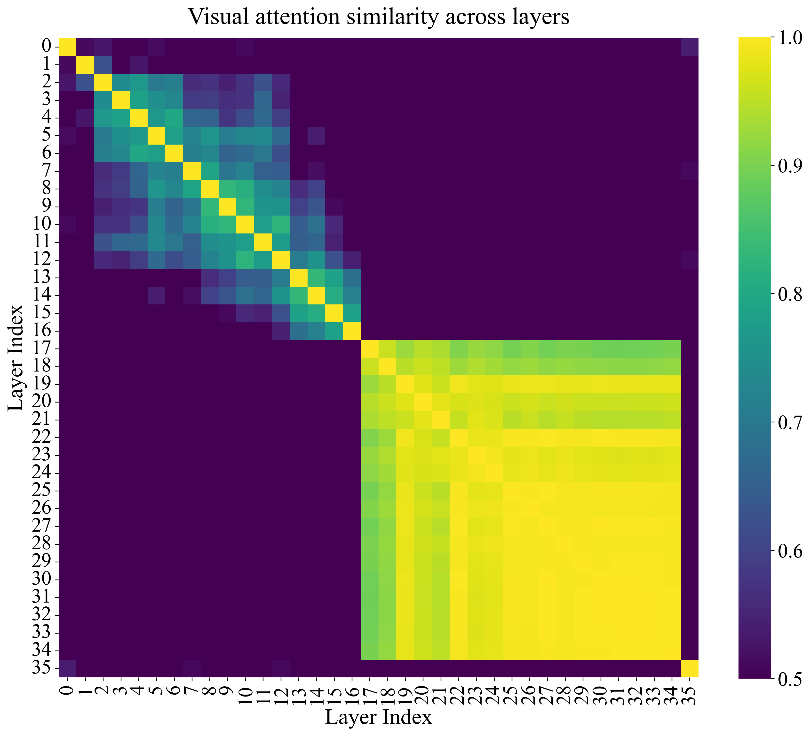

# Layer-wise visual attention similarity

Compare visual attention distributions across language-model layers during reasoning.

## Run

Follow the [analysis setup](../README.md#get-started), then run:

```bash
python -m analysis.run layer_similarity \
  --model Qwen/Qwen3-VL-4B-Thinking \
  --image assets/vent_example.png \
  --output-dir outputs/analysis/layer_similarity
```

Output: **`outputs/analysis/layer_similarity/average_layer_similarity.png`**.
The command analyzes all layers. Use `--image` and `--question` for your own
input, and `--model /path/to/model` for local weights.

## Example



Each cell shows the cosine similarity between two layers' visual attention
vectors, averaged over decoding steps. Higher values indicate more similar
attention distributions. This example covers all **36 layers** of
Qwen3-VL-4B-Thinking on the vent image; layer indices start from 0.

## Analyze collected samples

Collect traces with `--all-layers`, as shown in the
[analysis guide](../README.md#analyze-multiple-samples), then run:

```bash
python -m analysis.layer_similarity.similarity \
  --data outputs/analysis/realworldqa
```

For multiple samples, the tool first averages over steps within each sample,
then averages the sample matrices with equal weight.
